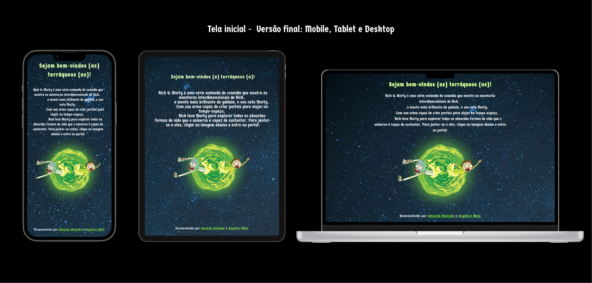

# Data Lovers

## Índice

* [1. Preâmbulo](#1-preâmbulo)
* [2. Resumo do projeto](#2-resumo-do-projeto)
* [3. Histórias de usuário](#3-histórias-do-usuário)
* [4. Protótipos da interface](#4-protótipos-da-interface)
* [5. Testes Unitários](#5-testes-unitários)
* [6. Testes de Usabilidade](#6-testes-de-usabilidade)
* [7. Sobre as Desenvolvedoras](#7-sobre-as-desenvolvedoras)

***

## 1. Preâmbulo

Segundo a
[Forbes](https://www.forbes.com/sites/bernardmarr/2018/05/21/how-much-data-do-we-create-every-day-the-mind-blowing-stats-everyone-should-read)
90% dos dados que existem hoje foram gerados durante os últimos dois anos. A
cada dia geramos 2.5 milhões de terabytes de dados, uma cifra sem precedentes.

Apesar disso, os dados por si só são de pouca utilidade. Para que essas grandes
quantidades de dados se convertam em **informação** compreensível para os
usuários, precisamos entender e processar estes dados. Uma forma simples de
fazer isso é criando _interfaces_ e _visualizações_.

Na imagem seguinte, você pode ver como os dados que estão na parte esquerda
podem ser usados para construir a interface amigável e compreensível que está na
parte direita.

## 2. Resumo do projeto

Neste projeto criou-se um site dedicado aos fãs de Rick and Morty com o objetivo de catalogar todos os personagens da série. Dessa forma, o
usuário consegue encontrar os seus personagens favoritos e obter mais informações sobre eles de maneira fácil e prática.

Iniciou-se o projeto fazendo uma pesquisa sobre o usuário. Concluiu-se que os principais objetivos do usuário em relação ao produto são:

A) Obter mais informações sobre seus personagens favoritos, principalmente sobre seu: nome, gênero, local de origem, espécie, imagem em quantos episódios aparecem e números de episódios;

B) Entretenimento: Utilizam o produto quando querem dar risada, sair um pouco da realidade ou usar o som da série como fundo musical.

## 3. Histórias do usuário

Iniciou-se o projeto determinando quatro (4) histórias de usuário:

### História 1: "Como fã da série, gostaria de poder visualizar todos os personagens da série para que eu consiga ter acesso as suas principais características de forma mais fácil."

A partir dessa história, criou-se a funcionalidade de exibir os cards dos personagens na tela. Definiu-se que essa história estava finalizada quando os cards de todos os personagens foram printados na tela do navegador.

### História 2: “Como fã da série, gostaria de saber quais personagens são alienígenas, pois eu amo ficção científica.”

A partir dessa história, criou-se a funcionalidade do botão espécie, na qual o usuário pode verificar quais espécies pertencem aos personagens. Definiu-se que essa história estava pronta quando os cards dos personagens filtrados por espécie (alienígena, humano e desconhecido) foram exibidos na tela do navegador.

### História 3: “Eu como estudante de Ciências Sociais, gostaria de saber a média de personagens femininas que existem na série para colocar nos dados do meu TCC.”

A partir dessa história, criou-se a funcionalidade de exibir a porcentagem dos personagens na tela de acordo com o filtro escolhido. Definiu-se que essa história estava finalizada quando foi exibido na tela do navegador a média dos personagens com base no filtro selecionado.

### História 4:  “Como fã de Rick and Morty, gostaria muito de encontrar os nomes dos personagens com facilidade, pois tenho muita dificuldade em memorizá-los.”

A partir dessa história, criou-se a funcionalidade de caixa de pesquisa na qual permite o usuário pesquisar o seu personagem pelo nome. Definiu-se que essa história estava finalizada quando, ao escrever o nome de um personagem na caixa de pesquisa, os cards referentes ao nome pesquisado eram exibidos na tela do navegador.

## 4. Protótipos da interface

Após definir as histórias de usuário, criou-se um protótipo de baixa fidelidade como consta na imagem abaixo:

Logo depois, criou-se no Figma um protótipo de alta fidelidade como consta nas imagens abaixo:

### Protótipo de alta fidelidade da tela de início - Mobile, Tablet e Desktop:

### Protótipo de alta fidelidade - Mobile:

### Protótipo de alta fidelidade - Tablet:

### Protótipo de alta fidelidade - Desktop:

## 5. Testes unitários

Inicialmente, criou-se um array mock chamado de `arrayTest` com o objetivo de simular um array para construir os testes de forma mais prática.

### Teste do objeto `dataFunctions`: 
Criou-se um teste para verificar se o objeto `dataFunctions`, que contém todas as funções principais no data.js, é um objeto. Logo depois, criou-se testes para as funções de filtrar, buscar por nome, ordenar e calcular a porcentagem dos personagens.

### Teste de filtrar: 
Primeiramente, criou-se um teste para verificar se a função `filtrar` se trata de uma função. Depois, definiu-se um teste para verificar a quantidade de objetos que continham o status 'morto' na array mock. Logo depois, foi testado em qual posição os objetos que continham o status 'morto' se encontravam na array mock. Fizemos o mesmo para testar o status 'vivo'. Seguindo a mesma lógica, definiu-se um teste para verificar a quantidade de objetos que continham o espécie 'alien' na nossa array mock. Logo depois, foi testado em qual posição os objetos que continham o espécie 'alien' se encontravam na array mock. Fizemos o mesmo para testar a espécie 'unknown'. Por fim, definiu-se um teste para verificar a quantidade de objetos que continham o gênero 'female' na array mock. Logo depois, foi testado em qual posição os objetos que continham o gênero 'female' se encontravam na array mock. 

### Teste de ordenar: 
Criou-se um teste para verificar se a função `ordenar` se trata de uma função. Além disso, definiu-se um teste para verificar a quantidade de objetos que retornavam na array mock quando a função era chamada. Por fim, criou-se um teste para verificar os objetos que retornavam os nomes dos personagens em ordem alfabética de forma crescente e descrescente.

### Teste de buscar por nome: 
Criou-se um teste para verificar se a função `buscarPorNome` se trata de uma função. Além disso, definiu-se um teste para verificar a quantidade de objetos que continham o nome 'Rick' na array mock.

### Teste de calcular a porcentagem:
Criou-se um teste para verificar se a função `calcularPorcentagem` se trata de uma função. Além disso, definiu-se um teste para verificar o câlculo da média dos porcentagens vivos e mortos da array mock.

## 6. Testes de usabilidade

A seguir estão os 4 (quatro) principais problemas detectados por usuários durante o processo de construção do projeto e como os mesmos foram solucionados.

### Problema 1
O usuário não conseguia visualizar as informações descritas nos cards dos personagens quando acessava a página principal do site no seu celular, pois os templates estavam dispostos em 3 (três) colunas. Dessa forma, para solucionar esse problema, alterou-se a disposição dos cards para apenas uma coluna, ficando bem mais legível e visível para o usuário, quando este acessa o site pelo seu celular.

### Problema 2
No primeiro momento, criou-se um campo de pesquisa com o objetivo de que o usuário pudesse pesquisar o personagem pelo nome. No entanto, colocou-se dentro do campo de pesquisa apenas a palavra "pesquisar". Por conta disso, o usuário relatou que ficou confuso sobre o que pesquisar, ou seja, se poderia pesquisar sobre o gênero do personagem, por exemplo. Para solucionar esse problema, adicionou-se dentro do campo de pesquisa o termo "buscar por nome". Dessa forma, ficou mais claro para o usuário o objetivo principal da sua pesquisa.

### Problema 3
No primeiro momento, criou-se o botão "Sobre" no cabeçalho da página principal, com o objetivo de redirecionar o usuário para uma página com informações sobre quem desenvolveu o site. No entanto, o usuário ficou confuso, relatou que não sabia do que se tratava esse "Sobre" e perguntou se era referente à informações sobre a série. Para solucionar esse problema, substituiu-se o botão para "Sobre nós". Dessa forma, ficou mais claro para o usuário do que se tratava a funcionalidade desse botão.

### Problema 4
No primeiro momento, adicionou-se uma imagem clicável na página inicial, com o objetivo do usuário, ao clicar na imagem, ser redirecionado para a página principal do site. Entretando, o usuário relatou que ficou confuso, pois ele não tinha a informação de que a imagem era clicável. Para solucionar esse problema, adicionamos um texto acima da imagem dizendo: "clique na imagem abaixo". Dessa forma, ficou mais claro para usuário de que ele deveria clicar na imagem para acessar a página principal do site.

## 7. Sobre as Desenvolvedoras
Projeto desenvolvido por Amanda Holanda [Linkedin](https://www.linkedin.com/in/amandaholanda/) | [GitHub](https://github.com/amanda-holanda) & Angélica Melo [Linkedin](https://www.linkedin.com/in/angellmelo/) | [GitHub](https://github.com/AngelMelo12) <3.

